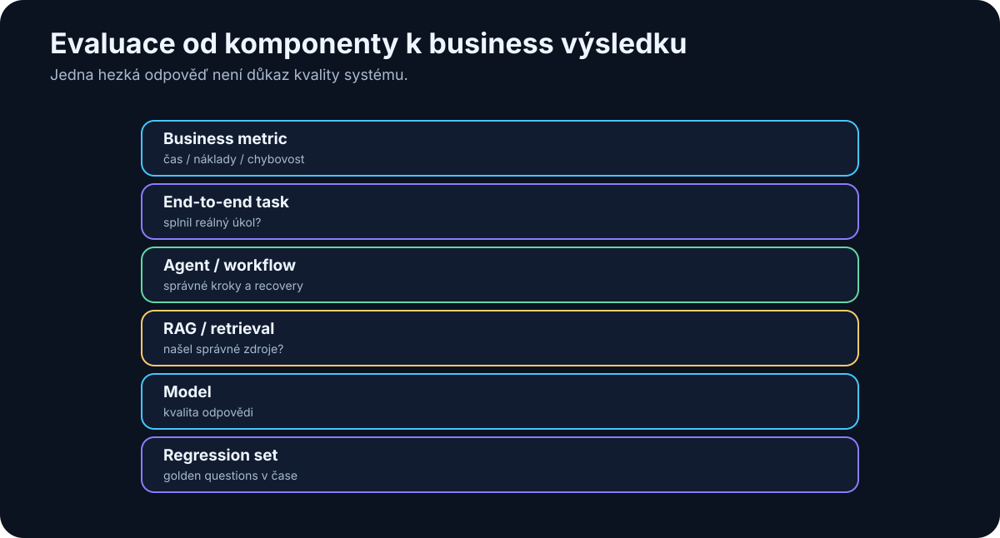

# 30. Evaluation

<!-- visual:30-evaluation-stack.svg -->



*Figure: From deterministic regression tests to business outcomes.*

The difference between an AI demo and an engineering system can be one question:

> **How do we know it works?**

With conventional software, a test often looks like:

```text
input A → expected output B
```

LLMs are harder. Several answers can be acceptable. The same model may phrase an answer differently on repeated runs. And a wrong answer can look highly professional.

So:

> “I tried ten prompts and most of them looked good.”

is not evaluation.

We need **evals**: systematic tests of the quality and behavior of the complete AI system.

> **Evaluation turns subjective impressions into evidence that can improve the model choice, prompt, retrieval, tools, and workflow.**

---

## 30.1 Test the Distribution, Not the Demo

A polished demo usually contains one friendly document and one easy question.

Production contains:

```text
normal cases
hard cases
ambiguous cases
missing data
conflicting data
malformed input
security attacks
tool failure
```

The evaluation set should represent the work we actually expect the system to face.

---

## 30.2 Ground Truth and Rubrics

**Ground truth** is a known reference answer:

```text
Question:
What is the startup limit?

Ground truth:
< 120 µs according to Spec C §7.4
```

It may come from an expert, database, simulator, test suite, or previously validated output.

Some tasks have no single perfect answer. Then define a **rubric**:

```text
technical summary must:
- mention all three failures
- avoid unsupported root-cause claims
- cite source runs
- separate fact from hypothesis
```

A rubric turns qualitative work into something more reproducible.

---

## 30.3 Build a Representative Test Set

Fifty high-quality real cases can be more valuable than 10,000 synthetic easy questions.

Include:

```text
common cases
+
edge cases
+
historical failures
+
ambiguous inputs
+
negative cases
```

Do not keep changing the test set whenever results look bad. A stable regression set is how we know whether a change actually improved the system.

---

## 30.4 Golden Questions

Keep a small set of critical tests that must always work.

For an engineering RAG system:

```text
1. current VDD limit
2. startup requirement
3. released vs. obsolete revision
4. cross-project ambiguity
5. missing-information case
```

Run them whenever you change:

- model,
- prompt,
- embedding model,
- chunking,
- ingestion pipeline.

This is the AI equivalent of a smoke test.

---

## 30.5 Automate What Can Be Checked Deterministically

Examples:

```text
valid JSON schema?         → validator
exact numeric field?       → comparison
classification label?      → exact match
citation source exists?    → lookup
code correct?              → tests / compiler
```

Deterministic evals are fast, cheap, and reproducible.

Do not pay an LLM to decide whether JSON is syntactically valid.

---

## 30.6 LLM-as-a-Judge

When exact checks are insufficient, a strong model can evaluate another model’s answer for correctness, relevance, completeness, and unsupported claims.

A concrete evaluator prompt:

```text
SYSTEM
You are an independent evaluator.
Do not improve the candidate answer and do not reward style.
Judge only against REFERENCE and RUBRIC.
If a claim is not supported by REFERENCE, count it as unsupported.

QUESTION
{question}

REFERENCE / GROUND TRUTH
{reference}

CANDIDATE ANSWER
{answer}

RUBRIC
1. factual_correctness: 0–4
   4 = all material claims are correct and supported
   2 = minor error or omission
   0 = major error / opposite conclusion

2. relevance: 0–2
   2 = directly answers the question
   1 = partly relevant
   0 = off task

3. completeness: 0–2
   2 = covers all required points
   1 = misses something material
   0 = misses most required content

4. unsupported_claims: integer
   number of factual claims unsupported by REFERENCE

OUTPUT
Return only JSON:
{
  "factual_correctness": 0,
  "relevance": 0,
  "completeness": 0,
  "unsupported_claims": 0,
  "verdict": "PASS|FAIL",
  "evidence": ["brief references to specific problems"]
}
```

Use schema-constrained output where available.

A judge is not objective truth. It can share biases or failure modes with the candidate model. Calibrate it against human experts, hide unnecessary model/vendor identity where that could bias evaluation, and inspect disagreement cases.

Only after judge scores correlate well enough with human judgment on **your use case** should it be trusted for large automated regression runs.

---

## 30.7 Human Evaluation

Humans are still needed for usefulness, trade-off quality, nuanced technical explanation, and other judgments without a clean deterministic reference.

Use a rubric instead of “rate this 1–10.”

| Criterion | 1 | 3 | 5 |
|---|---|---|---|
| Correctness | major errors | minor errors | no known error |
| Completeness | important gaps | mostly complete | complete |
| Evidence | unsupported | partly cited | all key claims grounded |
| Usefulness | unusable | requires work | ready to use |

This makes reviewers more consistent and results easier to compare over time.

---

## 30.8 Regression Testing

Every change can improve one behavior and damage another:

```text
new model
new system prompt
new embedding model
new chunking
new tool schema
```

A regression suite prevents a “better-feeling” upgrade from silently breaking production behavior.

Do not look only at total score. Inspect which cases improved and which regressed.

A new reasoning model might solve harder problems while becoming worse at strict structured output.

---

## 30.9 Evaluate Agents as Paths, Not Answers

An agent is a trajectory through state and tools.

Measure:

- final task success,
- number of steps,
- correct tool selection,
- correct arguments,
- recovery after errors,
- prohibited-action attempts,
- cost,
- latency.

Example:

```text
Agent A
success 92%
median steps 18
cost $1.20

Agent B
success 90%
median steps 7
cost $0.28
```

Which is better depends on the workload and cost of failure.

We evaluate the **system**, not the model’s apparent intelligence.

---

## 30.10 Evaluate RAG in Two Layers

### Retrieval

Did the system retrieve the correct evidence?

Metrics include Recall@K and MRR.

### Generation

Given correct evidence, did the model answer correctly and faithfully?

Measure correctness, completeness, citation quality, and unsupported claims.

If retrieval never found the correct chunk, replacing the generator model is unlikely to fix the real problem.

---

## 30.11 Tool-Use Evaluation Is Also Security Evaluation

Test whether the model:

- chooses the right tool,
- supplies valid arguments,
- avoids unnecessary calls,
- interprets results correctly,
- handles tool errors.

Also include negative tests:

```text
user requests prohibited production delete
→ expected behavior = refuse or require approved escalation
```

A tool-use eval simultaneously tests capability and the safety envelope.

---

## 30.12 End-to-End Business Metrics

At the top of the stack, ask:

> Does this system improve the real work?

A 96% technical accuracy score may be interesting. If humans still do 90% of the original work manually, business impact is small.

Useful metrics include:

```text
human minutes per task
lead time
throughput
error escape rate
cost per completed case
customer/user satisfaction
```

The most important evaluation is often:

```text
AI QUALITY × WORKFLOW IMPACT
```

---

## Evaluation Pyramid

```text
              BUSINESS KPI
                  ▲
            HUMAN EVALUATION
                  ▲
        LLM / SEMANTIC JUDGES
                  ▲
        AUTOMATIC TASK EVALS
                  ▲
      SCHEMA / RULE / UNIT TESTS
```

The lower a property can be verified, the better. Use expensive subjective evaluation only where deterministic evidence cannot answer the question.

---

## Failure-Driven Eval Development

Production failures are valuable future tests:

```text
production failure
↓
root cause
↓
add test case
↓
fix system
↓
keep regression test forever
```

This is the same discipline that makes conventional software more robust over time.

---

## Key Takeaways

1. **“Looks good” is not evaluation.**
2. **Ground truth or a clear rubric is the basis of a meaningful test.**
3. **Representative real cases matter more than huge numbers of easy examples.**
4. **Golden questions provide fast regression coverage for critical behaviors.**
5. **Use deterministic checks whenever possible.**
6. **LLM-as-a-judge is useful only after calibration against humans on the actual use case.**
7. **Agent evals measure the whole path: tools, recovery, safety, cost, and success.**
8. **RAG must be evaluated separately for retrieval and generation.**
9. **Tool-use evals should include forbidden and risky actions.**
10. **The final measure is impact on real workflow and business outcomes.**

Once quality is measurable, we can finally ask the economic question honestly:

> **What does AI actually cost, and when does it pay for itself?**