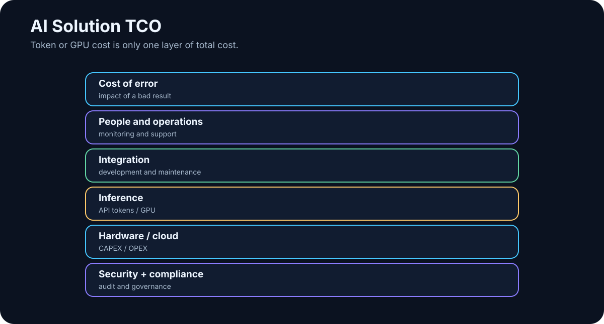

# 31. The Economics of AI

<!-- visual:31-ai-tco.svg -->



*Figure: Tokens and GPUs are only part of the total cost.*

AI can be extraordinarily cheap or surprisingly expensive. It depends on what we count.

A short cloud-model answer may cost almost nothing. An agentic workflow may trigger:

```text
30 model calls
+
web search
+
RAG
+
Python
+
image processing
+
retries
```

A local model may look like it has “free tokens,” while the GPU, electricity, administration, maintenance, and idle capacity are very real costs.

So the useful question is not:

> “What does one million tokens cost?”

It is:

> **What does one successfully completed task cost, and what value does that task create?**

---

## 31.1 Token Price Is Only the First Layer

A simplified API bill is:

```text
cost = input_tokens × input_price
     + output_tokens × output_price
```

Real pricing may also distinguish cached input, reasoning, modalities, or tool usage.

Long context can therefore become a cost driver. Poor retrieval that sends 100 pages when five paragraphs would do increases:

- cost,
- latency,
- context noise.

Context engineering is also economic engineering.

---

## 31.2 GPU Cost Depends on Utilization

On-prem systems have fixed costs:

```text
GPU / server
storage
network
power
cooling
support
administration
spares
```

A costly GPU can be economically excellent when heavily used. The same GPU can be expensive when it runs ten minutes per day.

That makes **utilization** one of the central variables in local AI economics.

---

## 31.3 Cloud and Local Have Different Cost Curves

Cloud begins with roughly:

```text
CAPEX ≈ 0
PAY PER USE
```

That makes it attractive for experiments, pilots, variable demand, and frontier capability.

Local inference behaves more like:

```text
higher fixed cost
+
lower marginal cost
```

but only until capacity is saturated.

A practical hybrid often emerges:

```text
stable baseline workload → local / on-prem
peaks or unusually difficult tasks → cloud
```

The choice is not purely financial; privacy, latency, availability, and model quality matter too.

---

## 31.4 Integration Can Cost More Than Inference

The model is often the cheapest part of a serious project.

Costs may be dominated by:

- ingestion,
- permissions,
- API integration,
- connectors or MCP servers,
- UI,
- testing,
- security review,
- operational ownership.

If annual API spend is €10,000 but integration costs €80,000, saving 10% on tokens is not the first optimization target.

> **Optimize the dominant cost in the system, not the most visible line item.**

---

## 31.5 Maintenance Is Part of TCO

AI systems change continuously:

- model versions,
- APIs,
- prompt behavior,
- embeddings,
- data sources,
- permission policy.

Production ownership therefore includes:

```text
monitoring
model upgrades
regression evals
security patches
workflow maintenance
support
```

An AI system without an owner decays like any other production software.

---

## 31.6 The Cost of Error Can Dominate Everything

Compare:

```text
AI awkwardly rewrites an internal email
→ low cost of error
```

with:

```text
AI misses a critical FAIL
→ potentially enormous cost
```

That can justify a more expensive control stack:

```text
fast model → first pass
stronger model → risky-case review
human → final approval
```

Inference cost increases while expected failure cost decreases.

The economic optimum is not necessarily the cheapest model.

---

## 31.7 ROI: Be Conservative About “Time Saved”

A simple ROI framing is:

```text
value created - total cost
--------------------------
        total cost
```

Value can come from:

- more throughput,
- shorter lead time,
- fewer escaped errors,
- lower external cost,
- faster time-to-market,
- released human capacity.

But “30 minutes saved” does not automatically mean the company gained 30 minutes × salary rate.

Stronger operational metrics are often:

```text
projects per quarter
reviews per engineer
cycle time
error escape rate
throughput per team
```

Measure what actually changes the process.

---

## 31.8 Total Cost of Ownership

A cloud system may include:

```text
API
+ integration
+ platform
+ security
+ monitoring
+ maintenance
```

An on-prem system may include:

```text
hardware
+ electricity
+ infrastructure
+ administration
+ model management
+ integration
+ monitoring
+ maintenance
```

Evaluate TCO over a meaningful period, such as three years, rather than comparing one month of API charges with a server purchase price.

---

## 31.9 Worked TCO Example: API vs. Dedicated GPU

**[Snapshot 08/2026] — Illustrative economics, not a quotation from any specific provider.**

Assume 100,000 tasks per month. Each averages:

```text
6,000 input tokens
1,000 output tokens
```

### Option A — cloud API

Illustrative rates:

```text
input  = €2 / 1M tokens
output = €8 / 1M tokens
```

Monthly volume:

```text
input:  600M tokens
output: 100M tokens
```

Model cost:

```text
600 × €2 + 100 × €8
= €2,000 / month
```

Add €200 in other paid tools/APIs:

```text
CLOUD VARIABLE COST ≈ €2,200 / month
```

### Option B — dedicated GPU server

Illustrative three-year model:

```text
server amortization          €333 / month
power                        €100 / month
cooling / power overhead      €30 / month
admin: 4 h × €60             €240 / month
maintenance reserve          €100 / month
-------------------------------------------
LOCAL TCO                    ≈ €803 / month
```

Local appears cheaper — **if** the server handles the required throughput, the local model is good enough, utilization is high enough, redundancy is not required, and human correction does not rise because of weaker model quality.

So the useful denominator is:

```text
COST PER SUCCESSFUL TASK =
(compute + tools + infrastructure + admin + human correction)
/
number of successfully completed tasks
```

If cloud success is 98% and local success only 80%, the apparent hardware saving may disappear in retries and human correction.

There is no universal token-count break-even point. It depends on workload, utilization, model quality, and cost of failure.

---

## 31.10 A More Expensive Model Can Be Cheaper

Consider:

```text
Model A
cost/run = $0.10
success = 60%

Model B
cost/run = $0.40
success = 95%
```

If each failed run consumes 20 minutes of human repair, Model B may be much cheaper per completed task.

A better equation is:

```text
TOTAL TASK COST =
AI compute
+
retry cost
+
human correction
+
expected cost of error
```

This matters especially for agents, where a stronger model may make fewer calls, choose tools more accurately, and require fewer repair loops.

---

## 31.11 When On-Prem Becomes Economically Attractive

On-prem economics improve when several conditions align:

- sustained utilization,
- a local model that actually meets the quality target,
- data-locality requirements,
- long-lived workload,
- existing operational capability.

A simple three-year comparison is:

```text
ON_PREM_3Y_TCO
----------------
expected successful tasks
=
local cost per successful task
```

versus cloud cost per successful task, including operational overhead.

Do not forget flexibility: cloud can deliver a materially better model next year without replacing hardware.

---

## 31.12 A Practical Cost Dashboard

For every production use case, track:

| Metric | Unit |
|---|---|
| Input tokens | / task |
| Output tokens | / task |
| Model calls | / task |
| Tool/API cost | / task |
| GPU time | / task |
| Human review | min / task |
| Retry rate | % |
| Success rate | % |
| Total cost | / successful task |
| Baseline human cost | / task |

This often reveals that the model itself is not the main cost. If inference is 5% of TCO and human review is 60%, optimizing token price is the wrong project.

---

## Key Takeaways

1. **Token price is not task cost.**
2. **GPU economics depend heavily on utilization.**
3. **Cloud and on-prem have different cost curves; hybrid can combine them.**
4. **Integration and maintenance may cost more than inference.**
5. **The cost of error can dominate model cost.**
6. **Measure operational value, not theoretical hours saved.**
7. **TCO must include infrastructure, people, maintenance, and correction.**
8. **A more expensive model can be cheaper per successful task.**
9. **On-prem break-even depends on workload and quality, not a universal token threshold.**
10. **The metric that matters most is cost per successfully completed task.**

Once economics, reliability, and evaluation are treated as one system, the final question becomes less about which model wins today and more about which capabilities are likely to reshape the architecture next.