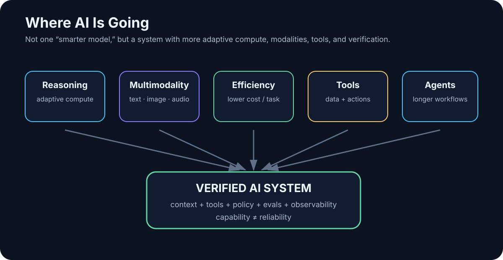

# 32. Where AI Is Going

<!-- visual:32-ai-trends.svg -->



*Figure: The trend is not only toward larger models, but toward systems that combine adaptive compute, modalities, tools, memory, and verification.*

Predicting AI several years ahead is a good way to be wrong in public.

Some capabilities have arrived faster than expected. Others look spectacular in demos and disappointing in production. Model prices, sizes, interfaces, and benchmarks move too quickly for a printed forecast to remain precise for long.

So this chapter is not a list of certainties. It is a map of the trends visible in August 2026.

The most important shift is not one specific model capability. It is this:

```text
MODEL
“answer me”
```

becoming:

```text
SYSTEM
“take this goal, use data and tools,
work through several steps,
and return a verified result”
```

That transition is the main axis of this book.

---

## 32.1 More Adaptive Reasoning

Models are becoming better at multi-step problems, and systems increasingly allocate different amounts of inference effort to different tasks.

```text
simple task
→ fast / low-cost reasoning

hard task
→ deeper reasoning

critical task
→ reasoning + tools + verifier
```

This is economically more interesting than making every request maximally expensive.

Stronger reasoning will not eliminate the need for evidence. In many high-value tasks, better reasoning makes grounding and verification **more** important because the system can construct more elaborate but still incorrect conclusions.

---

## 32.2 Cheaper Capability Changes What Becomes Automatable

The frontier may continue to consume enormous compute, while a fixed level of capability becomes cheaper through:

- better architectures,
- quantization,
- sparsity and mixture-of-experts designs,
- accelerators,
- inference optimization,
- caching.

The important consequence is not merely lower cost for today’s use cases.

A task that is uneconomic at 10,000 executions per day today may become a routine background process later.

> **Falling inference cost creates new use cases, not just cheaper old ones.**

---

## 32.3 Smaller Local Models Will Matter More

Small and medium open-weight models continue to improve.

That strengthens:

```text
local AI
edge AI
private AI
specialized models
```

A workstation model does not have to match the strongest frontier system at everything. It only has to be good enough for the task it owns.

A future stack may look like:

```text
small local model
→ routine extraction, routing, classification

larger local/server model
→ harder internal tasks

frontier cloud
→ exceptional reasoning / multimodal work
```

That is simultaneously a performance, cost, resilience, and security architecture.

---

## 32.4 Longer Context Will Not Kill Retrieval

Larger context windows make it easier to work with whole documents, larger code regions, and longer task histories.

But longer context still costs memory, tokens, latency, and attention.

And:

> **Having the right fact somewhere in a giant context is not the same as reliably using it.**

So long context and retrieval are likely to complement each other:

```text
retrieval
→ identify relevant evidence

larger context
→ include enough surrounding material to interpret it correctly
```

---

## 32.5 Memory Will Become a Truth-Management Problem

Robust agent memory is not just “more chat history.”

A useful system must decide:

- what to store,
- what to forget,
- what is obsolete,
- which source is authoritative,
- who may retrieve it,
- whether the memory itself was poisoned.

Memory may split into layers:

```text
working state
project memory
user preferences
validated facts
archive
```

The hard problem is not capacity. It is **truth over time**.

```text
VDD was 1.8 V in revision B
VDD is 1.2 V in revision C
```

A good memory system preserves history while understanding which fact is current.

---

## 32.6 Multimodality Expands the Work Surface

For users, the boundaries between text, image, audio, video, and screen interaction are already becoming less important.

That matters enormously in technical work because real evidence appears in:

- schematics,
- plots,
- waveforms,
- microscope images,
- screenshots,
- diagrams,
- spoken discussions.

Multimodal systems let agents interact with a much larger fraction of the actual work environment.

---

## 32.7 Computer Use Is a Bridge, Not the Ideal Interface

When an application has no API, AI can sometimes operate the UI like a human:

```text
screenshot
→ vision model
→ click / type
→ new screenshot
```

That unlocks legacy software, but UI automation is usually more fragile than a programmatic interface.

A sensible hierarchy is:

```text
API / MCP
→ preferred

CLI
→ excellent

computer use
→ fallback when no structured integration exists
```

Computer use is powerful precisely because so much enterprise software was designed only for humans. It should not stop us from building better machine interfaces where we control the software.

---

## 32.8 Software Will Become Agent-Ready

Today, software is designed primarily for people:

```text
menus
forms
dashboards
```

Future systems will increasingly serve two kinds of users:

```text
HUMAN
+
AGENT
```

That pushes applications toward:

- explicit APIs,
- machine-readable state,
- scoped permissions,
- event streams,
- audit logs,
- agent-friendly documentation.

“Has a chatbot” may become much less important than “is safely operable by agents.”

---

## 32.9 Background Agents May Matter More Than Chat

Many useful agent tasks do not require an interactive conversation.

```text
every night
→ inspect new regression failures
```

or:

```text
new specification revision
→ compare with current requirements
```

These agents behave more like background workers than chatbots.

That means they need scheduler or event triggers, durable state, checkpoints, notification policy, budgets, and audit.

Because nobody is watching every step, background autonomy requires stronger guardrails, not weaker ones.

---

## 32.10 Robotics Raises the Cost of Mistakes

A software agent can damage a file. A robot can damage a physical object.

That makes layered control even more important:

```text
LLM planning
↓
robot policy / controller
↓
physical action
↓
sensors
↓
verification
```

The LLM is unlikely to be the component directly controlling every motor current. As in engineering software, probabilistic reasoning belongs above deterministic control loops.

---

## 32.11 AI + Simulation Is a Powerful Scientific Pattern

AI is probabilistic. A simulator can return externally checkable evidence under a defined model and assumptions.

Together they create:

```text
AI
→ hypothesis

SIMULATION
→ evidence

AI
→ updated hypothesis
```

This applies to electronics, mechanics, fluids, chemistry, manufacturing, and many other domains.

AI does not have to encode the entire physics perfectly in its weights. It can become valuable by **organizing good experiments over a physical model**.

---

## 32.12 Faster Experimental Loops May Matter More Than “Knowing Everything”

Scientific and engineering work follows a familiar cycle:

```text
hypothesis
→ experiment
→ data
→ analysis
→ new hypothesis
```

AI can accelerate literature review, experiment design, scripting, analysis, and anomaly detection.

But scientific validity still depends on methodology, reproducibility, and evidence.

The most transformative systems may therefore be those that **close experimental loops faster**, not those that merely answer more questions from memory.

---

## 32.13 Personal AI Will Become More Personal — and More Sensitive

A useful personal AI may know:

- projects,
- notes,
- decision history,
- preferences,
- available tools.

The better it becomes, the more sensitive context it may hold.

That makes hybrid designs attractive:

```text
local memory
+
local processing
+
selective cloud reasoning
```

Personal AI may become one of the clearest examples of why privacy architecture and capability architecture are the same design problem.

---

## 32.14 Enterprise AI Will Look Like an Operating Layer

The enterprise question will move away from:

> “Which chatbot do employees use?”

and toward a shared platform:

```text
identity
model gateway
data access
retrieval
MCP / tools
agent runtime
evals
observability
security
```

Dozens of use cases can then share the same trusted infrastructure.

A company may not build one giant “AI project.” It may build an **AI operating layer** across its digital processes, much as companies previously built cloud and data platforms.

---

## 32.15 Design for Breakthroughs You Cannot Predict

We can extrapolate trends, but the next decisive breakthrough may come from somewhere less predictable:

- training efficiency,
- long-horizon reasoning,
- continual learning,
- memory,
- autonomous verification,
- hardware,
- robotics.

The best preparation is architectural flexibility.

```text
MODEL GATEWAY
→ models can change

TOOL INTERFACE
→ integrations survive model changes

EVAL SUITE
→ new capability can be measured
```

> **Do not build the system around one model. Build a capability that can absorb new models quickly and prove whether they actually help.**

---

## What I Expect to Age Slowly

Specific products will age quickly. The following design principles should age more slowly:

1. **Separate models from the systems built around them.**
2. **Route work to the smallest model that reliably meets the requirement.**
3. **Use retrieval and tools to connect models to fresh evidence and deterministic capability.**
4. **Keep permissions and safety outside model persuasion.**
5. **Treat memory as versioned knowledge, not unlimited chat history.**
6. **Close loops with tests, simulations, measurements, or other verifiers.**
7. **Design integrations so models can be replaced.**
8. **Measure cost and success at the task level.**
9. **Expect more AI work to move into background workflows.**
10. **Build for change rather than betting everything on one forecast.**

The final chapters become more personal. After tracing all of these layers, what have I actually learned — and which parts still need to be tested rather than merely understood?