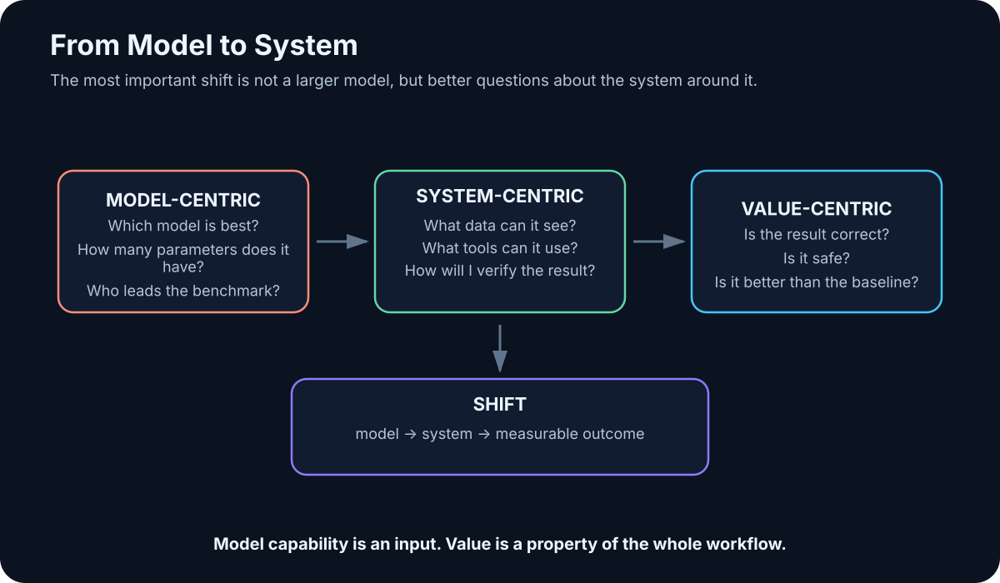

# 33. What I Have Learned So Far

<!-- visual:33-model-to-system.svg -->



*Figure: The biggest shift in my understanding of AI was not toward larger models, but from the model to the system around it.*

When I started going deeper into AI, the obvious question was:

> **Which model is best, and what can it do?**

After a while, a different question became much more interesting:

> **How do I turn a capable model into a system that is genuinely useful in real work?**

That is probably the biggest change in perspective captured by this book.

At first, AI looks like an unusually smart chat interface. Then you discover local models, RAG, context engineering, tools, MCP, coding agents, and agent loops. The model gradually moves from center stage into its proper place: one component in a larger system.

This chapter is not a declaration that I now “understand AI.” It is a snapshot of what seems most important to me in August 2026.

---

## 33.1 I Started Too Model-Centric

My early questions looked like this:

```text
GPT or Claude?
How many parameters?
Which benchmark leader?
What is the largest model I can run locally?
```

Those questions still matter, but they no longer feel like the main ones.

A strong model with the wrong context can be almost useless. A model without tools can recommend an action but cannot verify its effect. A model without a well-defined use case can become an expensive toy.

The first big mental shift was:

```text
AI SYSTEM ≠ MODEL
```

More usefully:

```text
model
+ context
+ data
+ tools
+ workflow
+ verification
```

I felt this most clearly while working with coding agents. A model could already generate code snippets. The interesting step came when an agent could inspect an existing repository, find the right files, modify only the necessary parts, run tests, and leave a reviewable diff.

The value came from the combination:

```text
model
+ repository context
+ filesystem
+ Git
+ tests
+ human review
```

The same logic carries directly into engineering. If AI is going to work on a circuit, talking intelligently about electronics is not enough. It needs real data, a simulator, and a way to verify the result.

---

## 33.2 Several Intuitive Ideas Turned Out to Be Too Simple

### “A bigger model will solve the problem.”

Sometimes. But if the system retrieved the wrong document or an obsolete revision, better reasoning still reasons over the wrong evidence.

### “A huge context window means I can put everything in it.”

Technically, perhaps. Operationally, that may increase cost, latency, and noise.

### “Once we have RAG, the model knows our company data.”

No. RAG quality depends on parsing, chunking, metadata, permissions, retrieval, and ranking. The model has not absorbed the data into its weights.

### “An agent is an LLM with a longer prompt.”

No. An agent is software with state, tools, a control loop, a verifier, and stop conditions.

### “Open-weight means easy to run locally.”

No. Available weights do not make memory requirements disappear.

The broader lesson is:

> **In AI, it is easy to confuse a beautiful abstraction with a working implementation.**

---

## 33.3 Tools Changed My View More Than Benchmarks

What keeps surprising me is how much capability appears when a model is connected to a relatively simple deterministic tool.

```text
LLM + Python
→ far more reliable data analysis
```

```text
LLM + filesystem + Git + tests
→ coding agent
```

```text
LLM + SPICE + measurement extraction
→ the beginning of a closed engineering loop
```

That often feels more important than another small benchmark gain.

A second surprise is how useful smaller models can be when the workflow is narrow and well designed. They do not need to be good at everything. They need to be good enough for their role.

---

## 33.4 What 8 GB vs. 32 GB VRAM Taught Me

My local-model experiments made the difference between “it runs” and “it is practical” very tangible.

On a laptop with 8 GB VRAM, smaller text models were useful enough to learn with, but larger workloads quickly exposed the memory limit. Once significant portions spilled into system RAM, interactive performance degraded sharply.

Moving to a 32 GB GPU opened a different class of experiment, including quantized models in roughly the 30B–40B range depending on the model. It also gave enough headroom to combine components such as:

```text
text LLM
+
Open WebUI
+
Whisper speech-to-text
+
text-to-speech
```

The most important lesson was not that “a bigger model fits.” It was that the stack can be decomposed and routed.

A smaller model may be sufficient for one role. Hard reasoning can go to a stronger internal or cloud model. Speech can be handled by a dedicated model. Retrieval can be separate again.

That is much more useful than searching for one universal model that must do everything.

---

## 33.5 What Has Been Most Useful So Far

### Text and document work

```text
summarize
extract
compare
rewrite
```

Low barrier, immediate value.

### Coding

Especially when AI can:

```text
read project
→ modify files
→ run tests
```

### Search and RAG

Not because vector databases are magical, but because retrieval puts private and current knowledge into the working context.

### Tool use

This is where the chatbot begins turning into a work system.

### Automatic verification

When I can verify the result with tests, a database, or a simulator, my relationship to the AI changes completely.

The combination:

```text
LLM flexibility
+
deterministic verification
```

is one of the strongest patterns I have found.

---

## 33.6 What I Now Treat as Hype Signals

I do not want to label entire technologies “hype.” The field changes too quickly for that to be useful.

Instead, I am skeptical of certain argument patterns.

### Demo without a baseline

> “Look, AI generated the report in one minute.”

Fine. How long did the old process take, and how many errors are in the new report?

### Multi-agent because it sounds advanced

Five agents using the same model and tools may be worse than one.

### Autonomy without a verifier

If the agent declares its own output correct, we do not have a real closed loop.

### “AI replaces the whole process” without integrations

If the model cannot see the data and cannot use the tools, it remains an adviser.

### Benchmark as proof of business value

Winning a benchmark does not mean winning our use case.

For me, hype is less about a particular technology and more about **skipping the engineering steps between model capability and a reliable outcome**.

---

## 33.7 Cloud vs. Local Became a Routing Problem

I originally found it easy to think of cloud and local AI as opposing camps.

I now think in workloads.

Local is attractive for:

- sensitive data,
- stable high-volume work,
- experimentation,
- smaller specialized models.

Cloud remains hard to ignore for:

- frontier reasoning,
- rapid access to new capabilities,
- elastic demand.

The architecture that makes the most sense to me is therefore:

```text
local where it makes sense
cloud where it adds real value
policy decides what may go where
```

That is not a compromise. It is routing.

Hardware becomes one more routing constraint: which task should run on a workstation, which on a stronger internal server, and which genuinely deserves frontier cloud compute?

---

## 33.8 Coding Agents Changed the Meaning of “Using AI”

Chat made natural language a universal interface to models.

Coding agents made the next shift visible:

```text
not only answer
```

but:

```text
search
→ modify
→ run
→ inspect
→ repair
```

That is a different category of tool.

The pattern transfers naturally into engineering:

```text
documentation
→ simulation
→ measurement
→ verification
```

I do not think an agent is best understood as a “digital employee.” It is a new way of composing software around an LLM.

---

## 33.9 The Most Valuable Question Is Often: What Is Missing?

When the model does not know what we decided yesterday, the answer is not automatically a larger model. It may need project memory or access to our notes.

When it does not know today’s value, it needs a current source.

When it must calculate accurately, it needs Python or another deterministic tool.

When it must verify a circuit, it needs a simulator.

So I now ask:

> **What is missing from the system that prevents the task from being completed reliably?**

Possible answers:

```text
context
data
retrieval
tool
permission
state
verifier
model capability
```

This diagnostic framing is far more useful than always asking for a smarter model.

---

## 33.10 My Current Mental Model

If I had to compress the whole book into one architecture, it would be:

```text
                 HUMAN GOAL
                     ↓
                 AI SYSTEM
                     ↓
        ┌────────────┼────────────┐
        ↓            ↓            ↓
      MODEL        CONTEXT       TOOLS
        ↓            ↓            ↓
   reasoning      evidence      actions
        └────────────┼────────────┘
                     ↓
                 REAL RESULT
                     ↓
               VERIFICATION
                     ↓
          PASS / REPAIR / ESCALATE
```

Around it sit permissions, state, observability, cost, and human responsibility.

That is the biggest lesson I have taken from this journey so far:

> **The model creates possibility. The surrounding system determines whether that possibility becomes useful, safe, and repeatable work.**

---

## Key Takeaways

1. **My thinking moved from model-centric to system-centric.**
2. **A larger model cannot compensate for wrong evidence or broken integration.**
3. **Tool use and deterministic verification often create more practical value than another benchmark increment.**
4. **Local hardware taught me to distinguish technical feasibility from usable performance.**
5. **Small specialized models can be excellent inside narrow workflows.**
6. **Cloud vs. local is best treated as workload routing.**
7. **Coding agents are a prototype for agentic knowledge work beyond software.**
8. **Hype usually appears when people skip the layers between capability and reliable outcome.**
9. **When a system fails, first ask which layer is missing or broken.**
10. **The durable subject is the system around the model.**

That naturally leaves one final personal question: which parts of this picture do I understand intellectually but still need to test in practice?