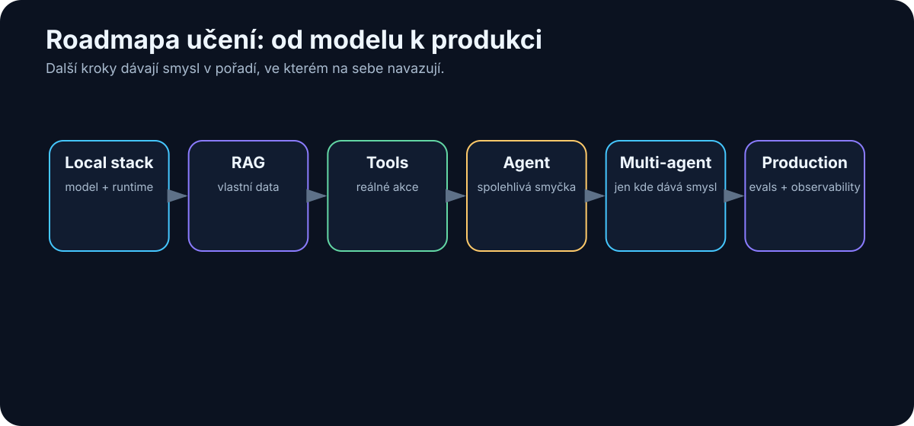

# 34. What I Still Need to Learn

<!-- visual:34-learning-roadmap.svg -->



*Figure: Local stack → RAG → tools → agent → production.*

After thirty-four chapters, it would be easy to feel as if most of the important territory has been covered.

It has not.

A large part of what I now understand is still **conceptual understanding**. The next phase has to be much more physical: build something, measure it, break it, repair it.

```text
build
→ measure
→ break
→ understand
→ improve
```

> **Every next learning step should end in a working artifact or a measurable experiment, not merely another page of notes.**

Chapter 36 turns that principle into concrete projects. This chapter is only my order of attack and my test for whether learning has actually happened.

---

## 34.1 My Order of Attack

```text
1  Build a local stack I can recreate from zero
2  Create my own model benchmark on my hardware
3  Build RAG with measurable retrieval and answer quality
4  Add tool use: read-only first, sandboxed writes later
5  Build one reliable agent with 50+ eval cases
6  Make evals and observability permanent infrastructure
7  Add second-brain memory only after the agent works without it
8  Test multi-agent against a single-agent baseline
9  Close an engineering loop through a simulator
10 Build a secure on-prem pilot for sensitive data
11 Run a measurable enterprise pilot with go/no-go criteria
12 Reach production: owner, SLA, monitoring, rollback
```

Some steps will overlap. The ordering still enforces one discipline:

> **First build a simple system I can measure. Then add complexity.**

Memory and multi-agent orchestration appear deliberately late. I want a concrete reason to add them and a baseline against which their value can be measured.

---

## 34.2 How I Will Know I Actually Learned Something

Not by the number of papers, videos, or tutorials consumed.

I will know when I can answer:

> “Why did this system fail?”

with evidence.

For example:

```text
the model was not the problem
retrieval selected an obsolete document
```

or:

```text
the agent understood the task
but the tool schema allowed an incorrect action
```

or:

```text
multi-agent increased cost 3×
and improved quality only 1%
```

Those are lessons that are difficult to obtain from tutorials because they belong to a specific system under real constraints.

That is why Appendix G treats the experiment log as part of the knowledge itself: configuration, metrics, failure, evidence, and what changed afterward.

---

## 34.3 The Standard I Want for Future Experiments

For every meaningful experiment, I want to be able to reconstruct:

```text
question
hypothesis
baseline
exact model/runtime
hardware
input data
permissions
metrics
failure cases
result
next change
```

If I cannot reconstruct the setup, I have an anecdote rather than evidence.

And if a failure does not become either a new test or a documented design lesson, I am wasting one of the most valuable outputs of experimentation.

---

## Key Takeaways

1. **The next phase of learning must produce artifacts and measurements.**
2. **Start with simple measurable systems before adding memory, multi-agent structure, or broader autonomy.**
3. **Evidence of understanding is the ability to explain a concrete failure mode.**
4. **Experiment logs are part of the knowledge; without configuration and metrics, experience is difficult to reproduce.**
5. **Every important failure should improve either the system or the eval suite.**

The last part of the book is therefore intentionally practical: **what is the smallest useful AI stack, and which projects should we actually build?**