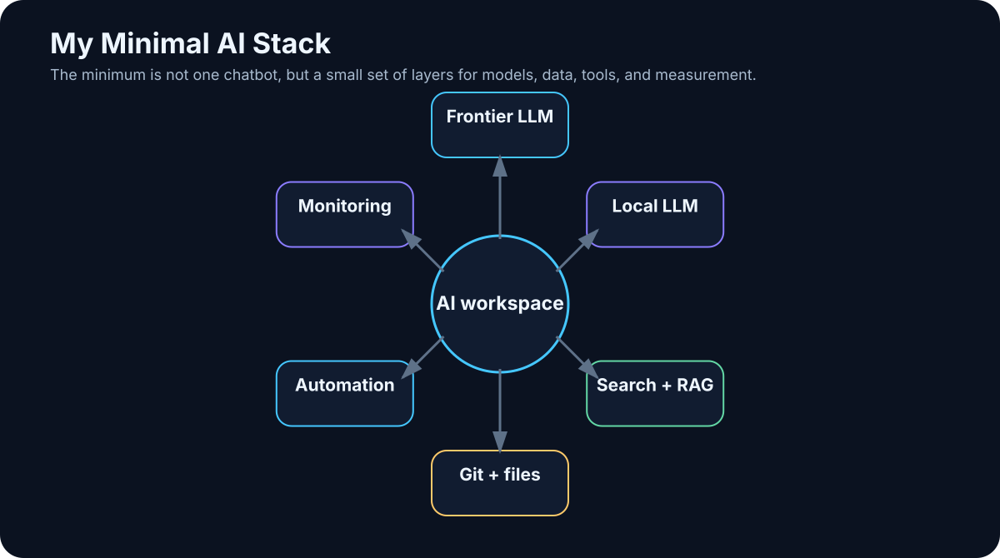

# 35. My Minimal AI Stack

<!-- visual:35-minimal-ai-stack.svg -->



*Figure: Models, data, tools, Git, automation, and monitoring — only as much infrastructure as the use case actually needs.*

Throughout the book, we kept adding layers:

```text
LLM
RAG
memory
tools
MCP
agents
orchestration
observability
evals
```

It is easy to finish with the impression that practical AI requires twenty servers and a small zoo of frameworks.

It does not.

For learning and for first real projects, I want the stack to stay deliberately small.

> **Every tool must solve a concrete problem. If I cannot justify a component in one sentence, I probably do not need it yet.**

My August 2026 stack has ten capability layers:

```text
1  Frontier model / chat
2  Local LLM
3  Web search
4  Coding agent
5  Speech-to-text
6  Knowledge base
7  Git
8  Automation
9  Agent runtime / framework
10 Monitoring + evals
```

That does not mean ten separate products on day one. One application may cover several layers initially.

---

## 35.1 One Strong Frontier Model

I want access to at least one high-quality frontier model for work where a local model is not enough:

- difficult reasoning,
- research,
- long documents,
- coding,
- multimodal tasks.

As of this edition, major frontier ecosystems include OpenAI, Anthropic, Google, and xAI. The exact model names will age faster than the architectural role.

A practical setup is:

```text
PRIMARY MODEL
→ most work

SECOND MODEL / API
→ cross-check or a use case where it is measurably better
```

I care about:

- reasoning quality,
- file handling,
- search or easy search integration,
- tool calling,
- API access.

I do **not** want the whole system to depend on one model name. Put models behind an interface that can change.

---

## 35.2 One Simple Local Runtime

For local experiments, simplicity matters more than architecture diagrams.

A practical starting point in this snapshot is:

```text
Ollama
```

because it provides straightforward model management and a local API.

A convenient UI can sit on top, for example Open WebUI.

When I need more control over GGUF models, quantization, or low-level inference behavior, `llama.cpp` is a useful layer. When I move toward a shared GPU service and supported workloads, a server-oriented runtime such as vLLM becomes relevant.

The model itself should be selected by benchmark, not by parameter-count ego.

For a 16 GB GPU, a capable model in roughly the 7B–14B class can be more useful than a much larger model that spills aggressively into slower memory.

---

## 35.3 Web Search with Source Access

A model without fresh external information cannot reliably answer questions about the current world.

For research, I want a workflow that looks like:

```text
search
→ open source
→ extract evidence
→ cite
```

not a source-free summary.

Important capabilities:

- open the original page,
- see publication date,
- filter domains,
- preserve citations.

For technical work, my source preference is roughly:

```text
primary source
→ official vendor docs
→ research paper
→ trusted secondary source
→ everything else
```

---

## 35.4 A Coding Agent

A coding agent is one of the most leverage-rich components in the stack because it helps build all the other experiments.

I want it to be able to:

```text
read repository
search
edit multiple files
run shell / tests
inspect failures
use Git
```

The exact product can change. The workflow matters more:

```text
TASK
→ branch / sandbox
→ agent changes
→ tests
→ diff
→ human review
→ merge
```

My rule is simple:

> **The agent may experiment in a branch. `main` remains an approval boundary.**

---

## 35.5 Speech-to-Text

Audio contains useful knowledge:

- meetings,
- interviews,
- podcasts,
- voice notes.

I care less about brand than about:

- language quality,
- technical vocabulary,
- speaker separation,
- timestamps,
- local processing when needed.

A practical output structure is:

```text
raw transcript
+
structured summary
+
source timestamps
```

The transcript remains evidence. The summary is a navigation layer.

---

## 35.6 Knowledge Base: Open Files First

For a human-readable knowledge layer, I prefer:

```text
Markdown
+
Obsidian or another file-based editor
+
Git
```

Why:

- I own the files,
- they remain readable without the AI application,
- they version cleanly,
- AI tools can process them easily.

The structure can stay simple:

```text
Projects/
Knowledge/
Meetings/
Experiments/
Sources/
```

with minimal metadata:

```yaml
---
title:
date:
type:
project:
status:
---
```

RAG should be an **index over the knowledge**, not the only place where the knowledge exists.

---

## 35.7 Git for More Than Code

Git is useful for:

- Markdown knowledge,
- prompts,
- agent skills,
- configuration,
- eval datasets,
- documentation,
- code.

It provides:

```text
versioning
history
diff
rollback
branching
review
```

For AI projects, I want at least code, prompts/instructions, schemas, skills, evals, and critical documentation under version control.

A model output without the model/workflow/data version is difficult to reproduce.

---

## 35.8 Automation: Start with the Boring Tool

The first automation may be no more than:

```text
Python script
+
cron / scheduler
```

Example:

```text
every morning
→ load new transcripts
→ create structured summary
→ save Markdown
```

If the workflow grows across many systems, a workflow engine can become useful. But keep the control model simple:

```text
TRIGGER
→ STEPS
→ CONDITIONS
→ OUTPUT
```

Add agentic decisions only where deterministic conditions stop being enough.

---

## 35.9 Agent Framework: Optional at First

I would happily build the first agent without a framework.

The essential loop fits conceptually into a small amount of code:

```text
while not done:
    call model
    execute allowed tool
    update state
    verify
```

That is a better way to learn the architecture than starting with a large abstraction stack.

Frameworks become useful when I actually need features such as:

- typed structured outputs,
- explicit state machines,
- durable execution,
- handoffs,
- tracing,
- human approval.

Relevant examples in this edition include OpenAI Agents SDK, Pydantic AI, and LangGraph, but the rule matters more than the name:

> **A framework should remove a problem I already have. It should not become the first problem in the project.**

---

## 35.10 Monitoring and Evals Belong Together

For the first experiment, structured logs may be enough:

```json
{
  "run_id": "2041",
  "step": 4,
  "model": "...",
  "tool": "search_docs",
  "latency_ms": 840,
  "status": "success"
}
```

I want visibility into:

- model calls,
- tool calls,
- retrieval,
- tokens,
- latency,
- errors,
- final result.

As the system grows, an observability platform becomes useful.

But observability and evaluation solve different problems:

```text
OBSERVABILITY
what did the system do?

EVALUATION
did it do the right thing?
```

A beautiful dashboard without an eval set is still a beautiful view of an unknown-quality system.

---

## 35.11 My Truly Minimal Day-One Setup

On a new machine, I would start with roughly:

```text
1. familiar IDE / editor
2. Git
3. Python
4. Ollama or another simple local runtime
5. local chat UI — optional
6. Obsidian or another Markdown knowledge editor
7. one coding agent
8. one strong frontier AI account / API
```

That is enough to build:

- local-model experiments,
- a small RAG prototype,
- Python tools,
- coding workflows,
- a knowledge base,
- a first agent loop.

Everything else can wait until a real requirement appears.

---

## 35.12 Minimal Small On-Prem Pilot

The next level might be:

```text
Linux workstation / server
+
NVIDIA GPU
+
local model runtime
+
web UI
+
RAG service
+
Git
+
MCP / API tools
+
structured logging
```

with security basics:

```text
internal network
least privilege
read-only first
secret management
audit
```

And still:

```text
one use case
one eval set
```

Do not start by building a universal enterprise AI platform.

---

## 35.13 What I Intentionally Leave Out at First

### Distributed vector-database cluster

Not until simpler storage or search fails at the required scale.

### Multi-agent framework

Not until one agent has a measurable limitation that splitting roles actually solves.

### Long-term memory platform

Not until I know exactly what must persist between runs.

### Kubernetes

Not until scaling and operations justify it.

### Fine-tuning pipeline

Not until prompt + context + tools + retrieval have been shown insufficient.

Minimalism is not a lack of ambition.

> **It is how I preserve causality: when the system improves, I can tell which component actually created the improvement.**

---

## Key Takeaways

1. **A minimal AI stack should cover needs, not collect fashionable frameworks.**
2. **One frontier model and one local runtime are enough to begin serious experimentation.**
3. **Choose local models by measured workload quality and fit, not parameter count alone.**
4. **A coding agent dramatically lowers the cost of building the rest of the stack.**
5. **Markdown + Git create a durable human-readable knowledge layer.**
6. **Start automation with deterministic scripts and schedules.**
7. **Agent frameworks are optional until complexity creates a concrete need.**
8. **Observability tells you what happened; evals tell you whether it was correct.**
9. **Start on-prem with one narrow use case and read-only permissions where possible.**
10. **Add infrastructure only when it solves a measured bottleneck.**

The final chapter turns this stack into a ladder of projects, each adding only one or two new capabilities at a time.