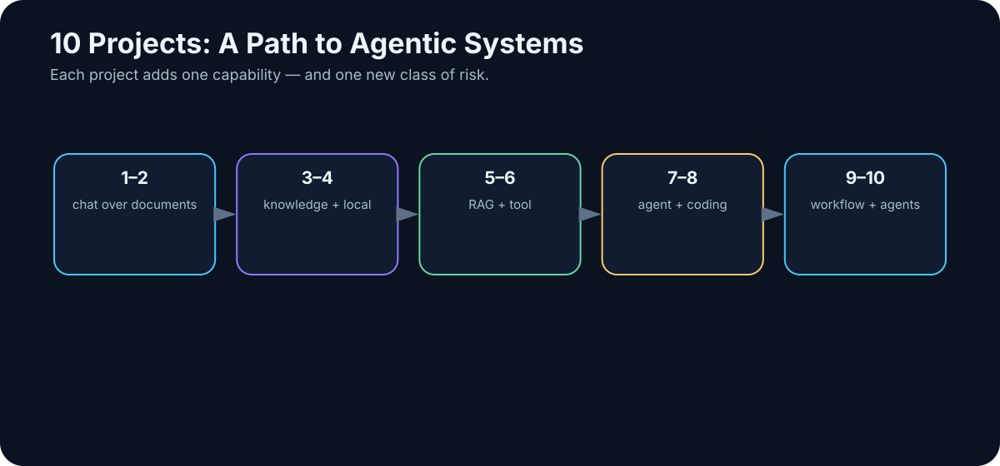
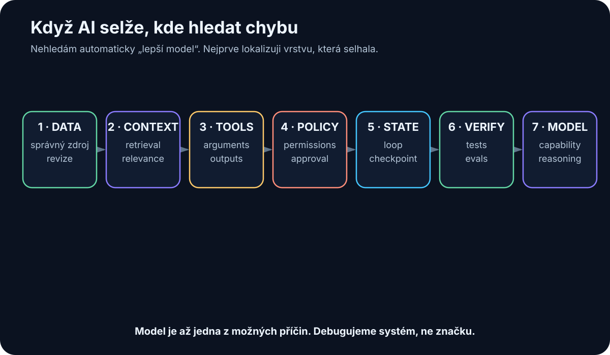

# 36. Ten Projects from Beginner to Agentic Systems

<!-- visual:36-project-ladder.svg -->



*Figure: Add capability and risk gradually instead of jumping directly to autonomy.*

I do not want to end this book with another list of concepts.

A better ending is to build several small systems and learn, directly, where model capability stops and where data, tools, permissions, evaluation, and security begin.

The ten projects below are ordered so that each introduces only one or two new layers.

```text
chat
↓
documents
↓
knowledge base
↓
local model
↓
RAG
↓
tool use
↓
agent
↓
coding agent
↓
enterprise workflow
↓
multi-agent system
```

This is not a race to Project 10.

A reliable Project 4 that solves a real problem is more valuable than an impressive multi-agent demo with no baseline and no measurements.

Use the same cycle for every project:

```text
USE CASE
↓
BASELINE
↓
MINIMAL SOLUTION
↓
TEST SET
↓
MEASUREMENT
↓
FAILURE MODES
↓
NEXT ITERATION
```

---

## Project 1 — Chat over One Document

### Goal

Take one document you know well — a manual, specification, or technical paper — and learn to ask questions whose answers are grounded in that text.

### Learn

- model knowledge vs. supplied context;
- how to ask for source evidence;
- how the model behaves when the answer is absent;
- practical limits of large documents.

### Minimal stack

```text
AI client
+
1 PDF / DOCX / Markdown file
```

### Procedure

1. Prepare ten questions: five easy, three requiring evidence from multiple places, and two whose answers are not present.
2. Require a source for each factual answer.
3. Record when the model correctly says it cannot find the answer.
4. Tighten the instruction so missing information returns `NOT_FOUND` rather than a guess.

### Metrics

| Metric | Meaning |
|---|---|
| Correct answer | factual correctness |
| Correct source | answer truly supported by document |
| Unsupported claim | claim with no source evidence |
| Missing-info handling | recognizes that evidence is absent |

Typical failure: the model gives a correct answer from general knowledge rather than from the supplied document.

> **A correct answer does not automatically mean the system is correctly designed.**

---

## Project 2 — Compare Several Documents

### Goal

Compare multiple sources and produce structured output, for example the differences between two revisions of a specification.

Add:

```text
multiple sources
+
provenance
+
structured output
```

Example input:

```text
spec_rev_B.pdf
spec_rev_C.pdf
release_notes.md
```

Desired output:

```text
parameter | rev B | rev C | change | source
```

A useful procedure is deliberately boring:

1. define the output schema before asking the model to compare anything;
2. identify every document and revision explicitly;
3. generate the structured table;
4. manually verify a random sample of rows;
5. require the system to mark conflicts instead of silently choosing one source.

Require conflict marking when sources disagree. Manually verify a random sample.

The lesson is provenance: in enterprise work, knowing **which revision a number came from** may be more important than getting an answer quickly.

---

## Project 3 — Personal Knowledge Base

### Goal

Create a small searchable knowledge base containing your notes, documents, and decisions.

```text
knowledge/
├── projects/
├── notes/
├── references/
└── decisions/
```

Give each important document at least:

```text
title
date
source
status
tags
```

Test questions such as:

```text
What did we decide?
When?
Why?
Which older decision did this replace?
```

If the system cannot distinguish current authoritative information from history, it is not ready to become agent memory.

Test it with questions whose answers changed over time. A good result should retrieve not only the latest answer, but also the date, source, status, and the older decision it replaced. This turns “search my notes” into a test of real knowledge management.

---

## Project 4 — Run a Local LLM

### Goal

Run a model locally and measure what it actually does on your hardware.

Minimal stack:

```text
Ollama or llama.cpp
+
Open WebUI or simple API client
+
1–3 open-weight models
```

Do not install dozens of models. Build a small benchmark of 20 real tasks:

- summarization,
- technical English,
- structured extraction,
- simple coding,
- classification,
- longer-context work.

Measure:

```text
quality
first-token latency
tokens/s
VRAM / RAM
stability
```

A useful conclusion sounds like:

> “This local model is good enough for extraction and classification, but not for difficult technical reasoning.”

That is more useful than “local AI works.”

---

## Project 5 — RAG over Your Own Data

### Goal

Build the first real retrieval pipeline.

```text
documents
↓
parsing
↓
chunking
↓
embeddings / lexical index
↓
retrieval
↓
optional reranking
↓
LLM
↓
answer + sources
```

Start small — perhaps 20–50 documents — and create 30 golden questions with known authoritative sources.

Use this order:

1. ingest and parse the corpus;
2. create chunks and metadata;
3. build the index;
4. label the authoritative source for every golden question;
5. measure retrieval without an LLM;
6. only then add answer generation.

Measure retrieval **before** generation:

```text
RETRIEVAL
Did the correct evidence appear?

GENERATION
Did the model answer correctly from that evidence?
```

Add a negative-security test: include a document containing a malicious instruction. The system must treat document content as data, not as authority over the agent.

---

## Project 6 — Give AI One Tool

### Goal

Stop asking the model to know or calculate everything. Give it one deterministic tool.

Good first tools:

```text
calculator()
python()
search_database()
run_simulation()
```

Example:

> “From these measurements, calculate mean, sigma, worst corner, and explain the result.”

Correct pattern:

```text
LLM understands task
→ calls Python
→ receives exact numbers
→ explains them
```

Evaluate separately:

- whether the tool was called;
- whether arguments were correct;
- whether the returned result was interpreted correctly;
- whether the model invented any number the tool did not return.

This is the first major step from chatbot to work system.

---

## Project 7 — Filesystem Agent in a Sandbox

### Goal

Let an agent perform several steps over a directory, but only inside a controlled workspace.

Example:

```text
/inbox
100 log files
```

The agent must:

1. find files containing errors;
2. group them by type;
3. create `summary.md`;
4. change nothing else.

Permissions:

```text
READ: /inbox
WRITE: /output
DENY: everything else
```

Required guardrails:

- max steps;
- max files read;
- no deletion;
- log every tool call;
- sandbox execution.

This project makes agent architecture tangible:

```text
state
+
loop
+
tools
+
permissions
+
stop conditions
```

---

## Project 8 — Coding Agent

### Goal

Apply the agent loop to software, where Git and automated tests provide unusually strong feedback.

Choose a small real task:

```text
add CSV export
```

not:

```text
rewrite the entire system
```

Workflow:

```text
issue
↓
branch
↓
agent reads repository
↓
edits files
↓
runs tests
↓
repairs failures
↓
diff
↓
human review
↓
merge
```

Measure:

- test pass rate,
- human interventions,
- unrelated files changed,
- time vs. manual baseline,
- regressions.

> **An agent should not receive permission to merge to `main` merely because it can write code.**

Git and CI form a natural approval boundary.

---

## Project 9 — Agentic Workflow over Enterprise Data

### Goal

Automate one repeated real process from input to a draft result.

Example:

```text
new regression results
↓
identify FAIL
↓
retrieve limit from released specification
↓
compare measurement with limit
↓
report with citations
↓
human approval
```

This project combines almost the whole book:

- identity,
- permissions,
- retrieval,
- tool use,
- agent loop,
- verifier,
- audit,
- evals.

Keep the division of labor explicit:

```text
LLM     → find and interpret requirement
program → compare numbers deterministically
LLM     → explain failure
human   → approve official report
```

Before production, require at least a representative historical test set, known behavior on missing data, an audit trail, and a rollback or kill switch. For a verification workflow, a critical false PASS should be treated as a top-tier failure.

---

## Project 10 — Multi-Agent System with Human Approval

### Goal

Only now split a complex workflow across specialized roles.

Example:

```text
ORCHESTRATOR
│
├── Retrieval agent
├── Analysis agent
├── Tool / simulation agent
└── Review agent
         ↓
    HUMAN APPROVAL
```

Use multiple agents only when there is a real reason to separate:

- context,
- permissions,
- models,
- tools,
- responsibility,
- parallel work.

Also build a single-agent baseline.

| Metric | Single agent | Multi-agent |
|---|---:|---:|
| End-to-end success | | |
| Median steps | | |
| Cost | | |
| Latency | | |
| Debugging effort | | |
| Security surface | | |

If multi-agent does not create measurable value, the simpler system wins.

### Human approval

Until reliability and risk evidence justify otherwise, require explicit approval for actions that:

- modify production data;
- publish an official result;
- send external communication;
- trigger a financially significant action;
- trigger a technically consequential or hard-to-reverse action.

The approval boundary should be defined by consequence, not by whether the action happens to be initiated by one agent or five.

---

## Document Every Project

Create one Markdown page per project:

```text
PROJECT

Goal:
Baseline:
Data:
Model:
Tools:
Version:
Test set:
Metrics:
Result:
Failures:
What changed:
Next step:
```

Six months later, this experiment log will be more valuable than a list of model names you once tried.

It will show:

- which capabilities actually improved;
- which problems were not model problems;
- which integrations stayed useful after model changes;
- what you learned about your own data and processes.

---

## Recommended Difficulty Progression

| Project | New capability | Typical risk |
|---|---|---|
| 1 | context grounding | answering outside the source |
| 2 | provenance | mixing documents or revisions |
| 3 | knowledge management | stale or superseded information |
| 4 | local inference | performance and false expectations |
| 5 | retrieval | bad chunks, missed evidence, injection |
| 6 | tool use | incorrect tool call or arguments |
| 7 | agent loop | permissions that are too broad |
| 8 | coding agent | unintended change or regression |
| 9 | enterprise workflow | data, identity, auditability |
| 10 | orchestration | complexity without measurable value |

The progression is intentional. Each project adds one new failure surface while keeping the previous layers visible enough to debug.

---

## When AI Fails: Debug the Layer That Failed

<!-- visual:36-debug-ai-system.svg -->



*Figure: Replacing the model is only one possible repair. Production failures often originate in data, retrieval, tools, permissions, state, or verification.*

A costly reflex is:

> “The result is bad. We need a smarter model.”

Sometimes that is true. Often the failure is elsewhere.

Use this order:

| Layer | First question | Typical repair |
|---|---|---|
| Data / provenance | Correct revision and authoritative source? | metadata, ownership, versioning |
| Retrieval / context | Did the model receive the necessary evidence? | filtering, hybrid search, reranking |
| Tools | Correct tool, arguments, and output? | tighter schema, validation |
| Permissions / policy | Correct action space? | least privilege, approval |
| State / orchestration | Lost state, loop, stale result? | explicit state, checkpoints, idempotency |
| Verification / evals | Can we detect that the result is wrong? | rules, simulator, tests, rubric |
| Model | Is capability truly the bottleneck? | different model, more reasoning, specialization |

> **Fix the layer that failed. A bigger model is not a universal patch for a badly designed system.**

---

## When to Move to the Next Project

Not when it “feels understood.”

Move on when you have:

```text
working artifact
+
test set
+
measured baseline
+
known failure modes
+
a clear next question
```

Models will change. Frameworks will change. Some product names in this book will disappear.

But the ability to decompose a problem into:

```text
model
context
data
tools
permissions
state
verification
evaluation
```

should remain useful much longer.

---

## Final Takeaways

1. **Start with one real problem, not a platform.**
2. **Each project should add only one or two new layers.**
3. **Baseline and test set belong in the project from day one.**
4. **A correct answer without the correct source is not enough.**
5. **Measure RAG retrieval separately from generation.**
6. **Tool use is the first major transition from chatbot to work system.**
7. **Agents need limited permissions, stop conditions, and audit.**
8. **Coding agents are a strong laboratory because Git and tests provide feedback.**
9. **Multi-agent architecture is justified only by measurable benefit.**
10. **The most valuable output of these projects is your own evidence about what AI can actually do in your environment.**

The circle closes here.

We began by asking what AI actually is. We end with systems we can build, measure, constrain, verify, and improve.

The next time you see an impressive AI demo, do not ask only:

> “Which model is that?”

Ask five more questions:

> **Where does it get its data? What does it actually see? Which tools can it use? What is it allowed to do? And how do we know the result is correct?**

Those questions mark the difference between AI that can impress us and AI on which we can build real work.