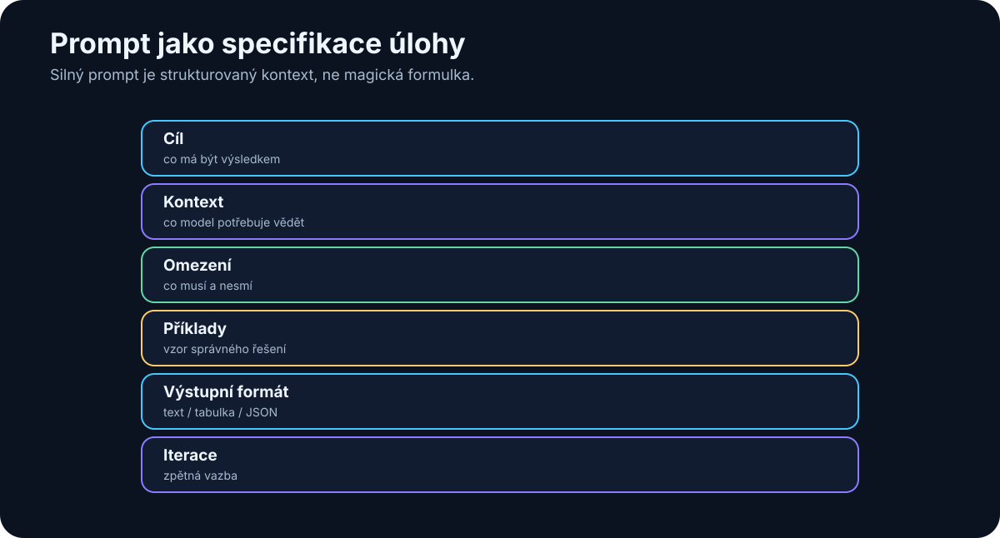

# 9. Prompting

<!-- visual:09-prompt-anatomy.svg -->



*Obrázek: Prompt jako strukturovaná specifikace úlohy.*


Kolem promptingu vznikla v prvních letech generativní AI téměř samostatná disciplína.

Internet byl plný seznamů typu:

> „50 tajných promptů, které změní ChatGPT v experta.“

Část těchto technik byla užitečná. Část byla spíš magie obalená technickými slovy.

Dnes je situace jasnější.

Moderní modely jsou výrazně lepší v pochopení běžného jazyka a nepotřebují tak často složité formulky.

To ale neznamená, že na zadání nezáleží.

Naopak.

> **Čím složitější práci chceme po AI, tím více se prompt podobá dobré technické specifikaci.**

Nejde tedy o hledání kouzelné věty.

Jde o to, aby model věděl:

```text
co má udělat
proč to dělá
s jakými informacemi
pod jakými omezeními
jak má vypadat výsledek
```

---

## 9.1 Prompt není kouzelná formulka

Začněme nejčastější chybou.

Lidé často hledají jednu univerzální formulaci:

```text
„Act as a world-class expert...“
```

která má údajně výrazně zvýšit inteligenci modelu.

Tak to nefunguje.

Prompt nemění počet parametrů modelu ani jeho trénink.

Může ale změnit:

- jak model interpretuje úkol,
- na co se zaměří,
- jaký styl výstupu zvolí,
- jak využije poskytnutý kontext.

Rozdíl mezi špatným a dobrým promptem proto může být dramatický, ale ne proto, že jsme odemkli skrytou inteligenci.

Spíše jsme odstranili nejasnost.

Například:

```text
Špatně:
Analyzuj tento dokument.
```

Model neví:

- co hledat,
- komu je výstup určen,
- jak detailní má být,
- zda má hledat chyby,
- zda má uvádět citace.

Lepší zadání:

```text
Z tohoto dokumentu vytáhni všechny požadavky na napájení.
U každého uveď hodnotu, jednotku, podmínku a číslo sekce.
Pokud je údaj nejasný nebo si dvě části dokumentu odporují,
označ to explicitně.
Nevymýšlej chybějící hodnoty.
```

Model není chytřejší.

Dostal lepší specifikaci.

---

## 9.2 Kontext je důležitější než „prompt engineering“

Můžeme napsat perfektní prompt:

```text
Najdi přesnou hodnotu VDD_CORE v revizi B specifikace projektu X.
```

Pokud model specifikaci projektu X nevidí, nemůže z ní spolehlivě odpovědět.

To vede k jednomu z nejdůležitějších pravidel:

> **Špatná nebo chybějící informace se nedá zachránit chytrou formulací promptu.**

Pro reálnou práci je často důležitější:

```text
správný dokument
+
správná verze
+
správná část dokumentu
```

než:

```text
sofistikovaný prompt
```

Proto se v dalších letech pozornost přesunula od **prompt engineeringu** ke **context engineeringu**.

Prompt je pouze jedna část kontextu.

---

## Anatomie produkčního promptu

U produkčního systému je užitečné přestat chápat prompt jako jednu větu. Reálný request se skládá z několika vrstev:

```text
┌──────────────────────────────────────────────┐
│ SYSTEM / DEVELOPER INSTRUCTIONS              │
│ role, pravidla aplikace, bezpečnostní hranice│
├──────────────────────────────────────────────┤
│ RUNTIME CONTEXT                              │
│ dokumenty, RAG, stav workflow, tool outputs  │
├──────────────────────────────────────────────┤
│ FEW-SHOT EXAMPLES (jen pokud pomáhají)       │
│ ukázky požadovaného chování / formátu        │
├──────────────────────────────────────────────┤
│ USER REQUEST                                 │
│ konkrétní cíl uživatele                      │
├──────────────────────────────────────────────┤
│ OUTPUT / FORMAT CONSTRAINT                   │
│ schema, JSON, tabulka, citace, limity        │
└──────────────────────────────────────────────┘
                         ↓
                        LLM
```

V agentním systému se k tomu přidává ještě seznam dostupných nástrojů, policy a success criteria. Praktické pravidlo:

> **Produkční prompt je sestavený kontext a kontrakt výstupu, ne pouze text uživatele.**

---

## 9.3 Role

Role říká modelu, z jaké perspektivy má úkol řešit.

Například:

```text
Jsi reviewer technické specifikace.
```

nebo:

```text
Posuzuj text z pohledu člověka, který bude podle dokumentu implementovat systém.
```

Role může být užitečná, protože mění zaměření.

Reviewer hledá jiné věci než autor.

Bezpečnostní auditor hledá jiné věci než marketingový redaktor.

Ale není potřeba role přehánět:

```text
Jsi nejlepší expert na světě s 40 lety zkušeností...
```

Takové formulace mohou ovlivnit styl, ale nevytvoří skutečných 40 let zkušeností.

Dobrá role je **funkční**, ne teatrální.

---

## 9.4 Cíl

Cíl je nejdůležitější část zadání.

Model potřebuje vědět, co má být na konci hotové.

Špatný cíl:

```text
Podívej se na tyto výsledky.
```

Dobrý cíl:

```text
Urči, které corner simulace nesplňují specifikaci,
a seřaď je podle velikosti odchylky.
```

Ještě lepší:

```text
Výsledkem má být tabulka, kterou může designer použít
pro rozhodnutí o další iteraci návrhu.
```

Čím lépe je definovaný výsledek, tím méně musí model hádat naši skutečnou potřebu.

---

## 9.5 Kontext

Kontext jsou informace, které model potřebuje ke splnění úkolu.

Může zahrnovat:

- dokument,
- data,
- historii rozhodnutí,
- pravidla projektu,
- definice pojmů,
- předchozí výsledky,
- profil uživatele,
- stav workflow.

Příklad:

```text
Cíl:
porovnat dvě verze specifikace

Kontext:
- revize A
- revize B
- datum obou dokumentů
- informace, která verze je aktuální
```

Bez posledního bodu může model sice najít rozdíly, ale neví, co je nové a co staré.

Kontext musí být nejen dostatečný.

Musí být také **relevantní**.

Příliš mnoho nerelevantních informací může model rušit.

---

## 9.6 Omezení

Omezení říkají, co model nesmí nebo nemá dělat.

Například:

```text
Používej pouze přiložené dokumenty.
```

```text
Nevymýšlej hodnoty, které ve zdroji nejsou.
```

```text
Neměň jiné soubory než src/parser.py.
```

```text
Před zápisem do databáze vyžádej approval.
```

Omezení jsou mimořádně důležitá u agentů.

V chatu může špatně pochopený požadavek znamenat špatnou odpověď.

U agenta může znamenat:

- změněný soubor,
- odeslaný e-mail,
- smazaná data,
- špatně spuštěný nástroj.

Proto musí být omezení někdy vynucena i technicky, ne pouze promptem.

---

## 9.7 Příklady

Model se může výrazně zlepšit, když mu ukážeme příklad správného vstupu a výstupu.

Například místo dlouhého popisu klasifikace:

```text
Vstup:
"Po poslední verzi se test občas zasekne."

Výstup:
BUG
```

```text
Vstup:
"Mohli bychom přidat export do CSV?"

Výstup:
FEATURE
```

Tím modelu ukážeme, jak hranici kategorií chápeme my.

Příklady jsou velmi užitečné tam, kde:

- kategorie nejsou samozřejmé,
- chceme konkrétní styl,
- formát má být velmi přesný.

---

## 9.8 Požadovaný výstup

Častou chybou je přesně popsat vstup, ale ne výstup.

Pak model vytvoří něco, co je sice správné, ale obtížně použitelné.

Například pro automatizaci nechceme:

```text
„Podle mého názoru se zdá, že...“
```

Chceme:

```json
{
  "status": "FAIL",
  "failed_tests": ["cold_start", "low_vdd"],
  "confidence": "high"
}
```

Pro člověka zase může být lepší:

```text
1. závěr
2. důkazy
3. rizika
4. doporučený další krok
```

Dobré zadání proto explicitně říká:

> **Jak má hotový výsledek vypadat?**

---

## 9.9 Zero-shot

**Zero-shot** znamená, že model dostane instrukci bez příkladu.

Například:

```text
Klasifikuj tento e-mail jako BUG, FEATURE nebo QUESTION.
```

Moderní modely zvládají mnoho takových úloh velmi dobře.

Zero-shot je vhodný, když:

- úloha je jasná,
- kategorie jsou intuitivní,
- nechceme plýtvat kontextem.

Začínat jednoduchým zero-shot promptem je často lepší než okamžitě stavět složitou prompt šablonu.

---

## 9.10 Few-shot

**Few-shot** znamená, že přidáme několik příkladů.

Například:

```text
Příklad 1
input: "Aplikace padá při startu."
output: BUG

Příklad 2
input: "Přidejte dark mode."
output: FEATURE

Nyní klasifikuj:
input: "Jak změním heslo?"
```

Model z příkladů pochopí nejen obsah kategorií, ale často i požadovaný formát.

Few-shot je užitečný, když:

- úloha je subjektivnější,
- interní terminologie se liší od běžného významu,
- chceme vysokou konzistenci.

---

## 9.11 Structured output

Pro automatizaci chceme výstup, který může přečíst program.

Proto používáme:

- JSON,
- definované schema,
- enum hodnoty,
- povinná pole.

Například:

```json
{
  "requirement_id": "REQ-174",
  "parameter": "VDD",
  "min": 1.7,
  "max": 1.9,
  "unit": "V",
  "source_section": "4.2.1"
}
```

Moderní API často umějí schema vynutit na úrovni rozhraní.

Pro striktní JSON/schema výstup je správný postup **structured output / constrained decoding + schema validation**. Nízká nebo nulová `temperature` může u podporovaných modelů snížit variabilitu, ale sama o sobě negarantuje validní JSON ani shodu se schématem. Pro produkci proto nespoléhejme na `temperature = 0` jako na validační mechanismus.

To je výrazně spolehlivější než pouze napsat do promptu:

```text
Prosím vrať JSON.
```

Structured output je jeden z mostů mezi LLM a klasickým softwarem.

---

## 9.12 Iterativní práce

U složitějšího úkolu není potřeba vše vyřešit jedním obřím promptem.

Často je lepší iterovat.

Například:

```text
1. navrhni strukturu
2. zkontroluj, co chybí
3. doplň data
4. napiš první verzi
5. udělej review
6. uprav výsledek
```

To připomíná práci s lidským kolegou.

Nejdříve se sladíme na směru a až potom investujeme práci do detailu.

Iterace také snižuje riziko, že model pochopí špatně hlavní zadání a vytvoří dlouhý, ale nepoužitelný výsledek.

---

## 9.13 Prompt jako specifikace

U vážné práce se prompt postupně mění ve specifikaci.

Dobrá šablona může vypadat:

```text
ROLE
Kdo jsi v tomto workflow?

GOAL
Jaký výsledek má vzniknout?

CONTEXT
Jaké informace jsou relevantní?

CONSTRAINTS
Co nesmíš udělat?

TOOLS
Jaké nástroje můžeš použít?

OUTPUT
Jak přesně má vypadat výstup?

SUCCESS CRITERIA
Jak poznáme, že je úkol hotový?
```

To už není „prompt engineering trik“.

Je to normální engineering.

Stejným způsobem specifikujeme API, test nebo výrobní proces.

---

## 9.14 Kdy prompt přestává stačit

Existuje bod, kdy další zdokonalování promptu už nepomůže.

Například chceme:

> „Najdi nejnovější cenu produktu.“

Model nemá aktuální data.

Potřebuje web.

Nebo:

> „Najdi změnu v 100 000 firemních dokumentech.“

Potřebuje search nebo RAG.

Nebo:

> „Oprav projekt a spusť testy.“

Potřebuje filesystem, editor a shell.

Nebo:

> „Pamatuj si všechna moje rozhodnutí několik let.“

Potřebuje externí memory.

Tady se dostáváme k zásadnímu přechodu:

```text
lepší prompt
      ↓
limit
      ↓
potřebuji lepší context
      ↓
potřebuji nástroje
      ↓
potřebuji celý systém
```

> **Prompt nemůže nahradit chybějící data, paměť ani nástroj.**

---

# Praktický příklad

Původní požadavek:

```text
Prostuduj naše simulace a řekni mi, co je špatně.
```

Lepší specifikace:

```text
ROLE
Jsi reviewer analogových simulačních výsledků.

GOAL
Najdi všechny testy, které nesplňují specifikaci.

CONTEXT
- přiložená specifikace je revize C
- výsledky jsou z runu 2026-08-05
- PASS/FAIL rozhoduj pouze podle limitů ve specifikaci

CONSTRAINTS
- nevymýšlej chybějící limity
- pokud není možné test vyhodnotit, označ UNKNOWN

OUTPUT
Tabulka:
test | corner | measured | limit | status | source

SUCCESS CRITERIA
Každý FAIL musí mít odkaz na konkrétní limit ve specifikaci.
```

Tento prompt není „chytřejší“ kvůli nějaké tajné frázi.

Je lepší, protože odstranil nejasnosti.

---

# Co si z kapitoly odnést

1. **Prompt není kouzelná formulka. Je to zadání práce.**
2. **Správný kontext je často důležitější než sofistikovaná prompt technika.**
3. **Nejdůležitější části jsou cíl, kontext, omezení a požadovaný výstup.**
4. **Příklady pomáhají modelu pochopit naše vlastní kategorie a styl.**
5. **Structured output propojuje pravděpodobnostní LLM s deterministickým softwarem.**
6. **U složité práce je často lepší iterovat než psát jeden obří prompt.**
7. **Dobrá prompt šablona se podobá technické specifikaci.**
8. **Když chybí data, paměť nebo nástroj, další prompt engineering problém nevyřeší.**

To nás přivádí přímo k další kapitole:

> **Jak řídit celý kontext modelu, ne pouze poslední větu, kterou mu napíšeme?**
