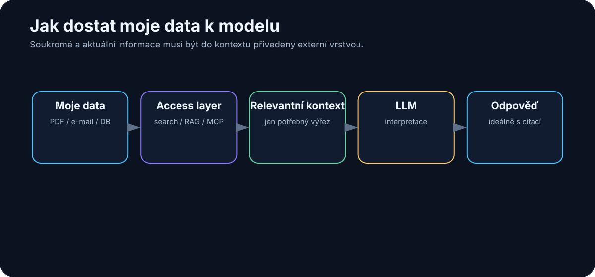

# 11. Proč model nezná moje data

<!-- visual:11-external-data-bridge.svg -->



*Obrázek: Soukromá a aktuální data musí být do kontextu přivedena externí vrstvou.*

LLM může mít rozsáhlé obecné znalosti a současně neumět odpovědět na jednoduchou firemní otázku:

> „Co jsme minulý týden rozhodli o projektu ABC?“

Důvod je architektonický. Model automaticky nevidí naše soubory, e-maily, databáze ani poslední commit.

```text
ZNALOSTI V PARAMETRECH MODELU
≠
DATA DOSTUPNÁ SYSTÉMU PRÁVĚ TEĎ
```

Model může obecně znát bandgap reference, ale bez externího zdroje nezná naši topologii, aktuální PVT výsledky ani důvod poslední změny.

---

## 11.1 Tři typy informací, které musíme dodat zvenku

### Soukromá data

```text
specifikace
repozitář
meeting notes
měření
interní databáze
```

Model je nemá mít automaticky. Přístup musí řídit identita a oprávnění.

### Aktuální data

```text
dnešní e-mail
nový release
aktuální cena
poslední simulation run
```

Aktuálnost je vlastnost připojeného systému, ne samotných vah modelu.

### Přesná autoritativní data

I když informace existuje, musíme vědět, **které verzi věřit**:

```text
spec_rev_A.pdf
spec_rev_B.pdf
spec_FINAL_old.pdf
spec_current.pdf
```

Proto knowledge systém potřebuje metadata jako `revision`, `status`, `owner`, `valid_from` a `obsolete`.

> **Retrieval řeší „najdi informaci“. Governance řeší „které informaci smíme věřit“.**

---

## 11.2 Jak data připojit

Neexistuje jeden univerzální mechanismus.

| Typ potřeby | Vhodný mechanismus |
|---|---|
| jeden známý dokument | vložit relevantní část do kontextu |
| přesný identifikátor / fráze | full-text / keyword search |
| významové hledání ve velké dokumentaci | RAG / semantic retrieval |
| strukturovaná čísla | SQL / API / deterministický nástroj |
| aktuální stav systému | API / tool call |
| mnoho zdrojů a více kroků | agentní workflow |

To je důležité: **ne všechno má být RAG**. SQL databázi nepřevádíme automaticky na embeddings jen proto, že systém obsahuje LLM.

---

## 11.3 Proč obvykle netrénujeme model na každé nové dokumentaci

Pro často se měnící znalost nechceme při každé revizi znovu měnit váhy modelu.

```text
nová revize specifikace
→ aktualizovat zdroj / index
→ další dotaz už používá nová data
```

Fine-tuning může být užitečný pro chování, styl, formát nebo specializovanou schopnost. Pro živou firemní dokumentaci je ale obvykle vhodnější **externí zdroj + retrieval + LLM**.

---

## 11.4 Můstek k RAG

Pokud máme jeden dokument, můžeme jej vložit ručně. Pokud máme desetitisíce dokumentů, potřebujeme automaticky vybrat pouze relevantní části.

```text
OTÁZKA
   ↓
NAJÍT RELEVANTNÍ EVIDENCE
   ↓
VLOŽIT JE DO KONTEXTU
   ↓
LLM
   ↓
ODPOVĚĎ + ZDROJE
```

Tento vzor se jmenuje **RAG — Retrieval-Augmented Generation** a je tématem následující kapitoly.

## Co si z kapitoly odnést

1. **Model automaticky nezná naše soukromá ani nová data.**
2. **Obecná znalost modelu a pracovní data systému jsou dvě různé vrstvy.**
3. **Data připojujeme podle typu: kontext, search, RAG, databáze nebo tool.**
4. **Často se měnící dokumentaci obvykle neřešíme přetrénováním modelu.**
5. **Autorita zdroje, verze a oprávnění jsou stejně důležité jako samotný retrieval.**
